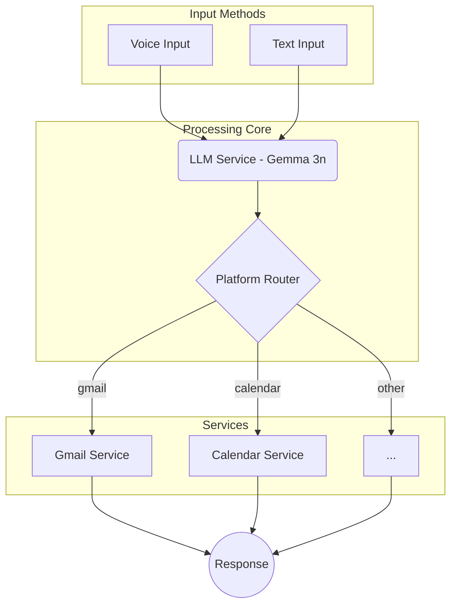

# 🎯 DAY 1 PLAN & GOALS

This document outlines the **initial plan and objectives** for Day 1 of development.

## 🚀 **High-Level Objectives**

-   **Goal**: Establish the core voice pipeline and implement basic functionality for Gmail and Calendar.
-   **Session 1 (Morning)**: Build the foundation with FastRTC and Gemma 3n integration.
-   **Session 2 (Afternoon)**: Implement voice commands for reading emails and checking the calendar.

---

## 🏗️ **Planned System Architecture**

### **1. Dual-Input Voice Pipeline**

A unified system was planned to handle both voice and text inputs, routing them through the same LLM and service layers for consistent command processing.

### **2. State-Based Voice Management**

A state machine was designed to manage the voice interaction lifecycle, providing clear user feedback and preventing conflicting operations.

-   **IDLE**: Awaiting wake word or text input.
-   **LISTENING**: Actively recording a voice command.
-   **PROCESSING**: Transcribing audio and processing the command.
-   **RESPONDING**: Generating and playing back the audio response.

### **3. Mock-First Development Strategy**

The plan was to build the system against mock services first. This allows for rapid development and testing without requiring immediate access to live APIs, credentials, or incurring costs.

-   ✅ **Benefit 1**: Faster iteration cycles.
-   ✅ **Benefit 2**: Predictable and repeatable testing.
-   ✅ **Benefit 3**: Zero-cost development using free-tier services and mock data.

---

## 🛠️ **Planned Technical Implementation**

### **Key Components to be Built**

1.  **Enhanced Voice Server (`voice_server.py`)**:
    -   **Wake Word Detection**: Recognize "Hey Minus" to activate listening.
    -   **State Management**: Implement the `IDLE`, `LISTENING`, `PROCESSING` states.
    -   **Silence Detection**: Automatically process command after a pause.
    -   **Unified Processing**: A single `process_command_unified` method for both voice and text.

2.  **Gemma 3n LLM Service (`llm_service.py`)**:
    -   **Google AI API Integration**: Connect to the free tier of the Gemma 3n model.
    -   **Command Parsing**: Convert natural language (e.g., "Read my emails") into structured JSON (`{"platform": "gmail", "action": "read_unread"}`).
    -   **Mock Mode**: Create a fallback mechanism for development without an API key.

3.  **Gmail & Calendar Services**:
    -   **Gmail (`gmail_service.py`)**: Implement a `process_voice_command` method to handle actions like `read_unread` and `compose`. Initially use mock email data.
    -   **Calendar (`calendar_service.py`)**: Implement a `process_voice_command` method to handle `check_today` and `create_event`. Initially use mock calendar data.

4.  **API Router (`routers/voice.py`)**:
    -   Create endpoints for handling text-based commands and managing the voice state.

This plan laid the groundwork for a scalable, testable, and cost-effective voice assistant. 

This document outlines the **initial plan and objectives** for Day 1 of development.

## 🚀 **High-Level Objectives**

-   **Goal**: Establish the core voice pipeline and implement basic functionality for Gmail and Calendar.
-   **Session 1 (Morning)**: Build the foundation with FastRTC and Gemma 3n integration.
-   **Session 2 (Afternoon)**: Implement voice commands for reading emails and checking the calendar.

---

## 🏗️ **Planned System Architecture**

### **1. Dual-Input Voice Pipeline**

A unified system was planned to handle both voice and text inputs, routing them through the same LLM and service layers for consistent command processing.

### **2. State-Based Voice Management**

A state machine was designed to manage the voice interaction lifecycle, providing clear user feedback and preventing conflicting operations.

-   **IDLE**: Awaiting wake word or text input.
-   **LISTENING**: Actively recording a voice command.
-   **PROCESSING**: Transcribing audio and processing the command.
-   **RESPONDING**: Generating and playing back the audio response.

### **3. Mock-First Development Strategy**

The plan was to build the system against mock services first. This allows for rapid development and testing without requiring immediate access to live APIs, credentials, or incurring costs.

-   ✅ **Benefit 1**: Faster iteration cycles.
-   ✅ **Benefit 2**: Predictable and repeatable testing.
-   ✅ **Benefit 3**: Zero-cost development using free-tier services and mock data.

---

## 🛠️ **Planned Technical Implementation**

### **Key Components to be Built**

1.  **Enhanced Voice Server (`voice_server.py`)**:
    -   **Wake Word Detection**: Recognize "Hey Minus" to activate listening.
    -   **State Management**: Implement the `IDLE`, `LISTENING`, `PROCESSING` states.
    -   **Silence Detection**: Automatically process command after a pause.
    -   **Unified Processing**: A single `process_command_unified` method for both voice and text.

2.  **Gemma 3n LLM Service (`llm_service.py`)**:
    -   **Google AI API Integration**: Connect to the free tier of the Gemma 3n model.
    -   **Command Parsing**: Convert natural language (e.g., "Read my emails") into structured JSON (`{"platform": "gmail", "action": "read_unread"}`).
    -   **Mock Mode**: Create a fallback mechanism for development without an API key.

3.  **Gmail & Calendar Services**:
    -   **Gmail (`gmail_service.py`)**: Implement a `process_voice_command` method to handle actions like `read_unread` and `compose`. Initially use mock email data.
    -   **Calendar (`calendar_service.py`)**: Implement a `process_voice_command` method to handle `check_today` and `create_event`. Initially use mock calendar data.

4.  **API Router (`routers/voice.py`)**:
    -   Create endpoints for handling text-based commands and managing the voice state.

This plan laid the groundwork for a scalable, testable, and cost-effective voice assistant. 
 
 